# Phineas and Ferb Analysis

Because why not?

### Goals

* I want to find out which of the main characters have the most lines/talks the most.
* I want to find out which characters is looking out for Perry the most
* I want to find out which of the characters is the most negative/positive

### Most Talkative Characters

From what's in `analyze_scripts.py` so far, we can see that Candace and Phineas have the most lines, but Doofenshmirtz speaks the most words. This makes sense, because Doofenshmirtz goes on long monologues when explaining his Inators to Perry the Platypus.

We can also see that Ferb is very quiet, speaking the fewest lines and the fewest words of any human character. Not entirely surprising.

What is surprising is how much Monogram speaks relative to the number of lines he has. Must be from giving Perry the Platypus all those missions.

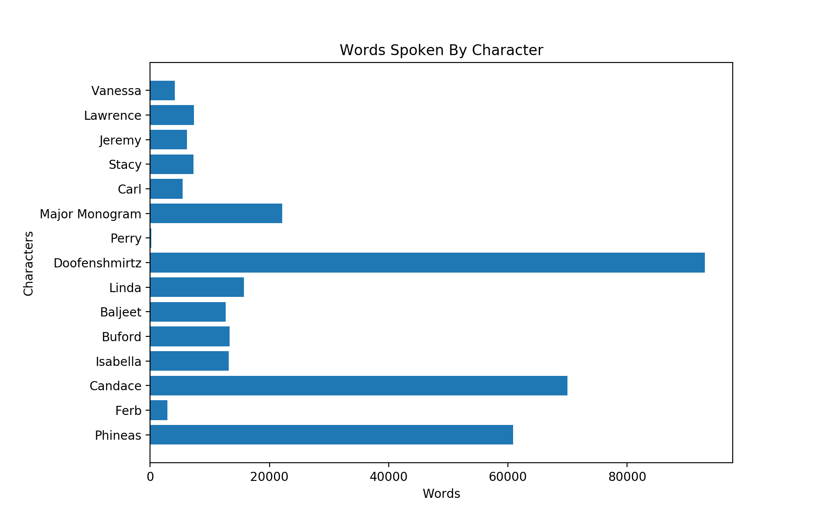

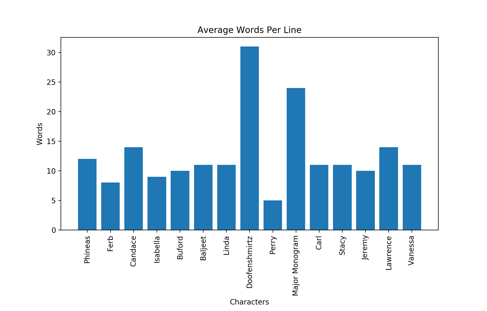

### Looking Out For Perry

Work in progress.

### Positivity of Characters

I wanted to figure out how positive/negative certain characters are and to do that I performed sentiment analysis. In order to do that, I used [nltk](http://www.nltk.org/api/nltk.sentiment.html)'s sentiment analyzer. That uses VADER, or Valence Aware Dictionary and sEntiment Reasoner - more information on how that works can be found in a [different Python package](https://github.com/cjhutto/vaderSentiment).

After plotting the resulting `compound` scores (they're a "normalized, weighted composite score" of positivity) per line for each character, I got these histograms. For each character, I also calculated the percent of lines that were positive (`compound >= 0.5`), negative (`compound <=-0.5`), and neutral (everything else).

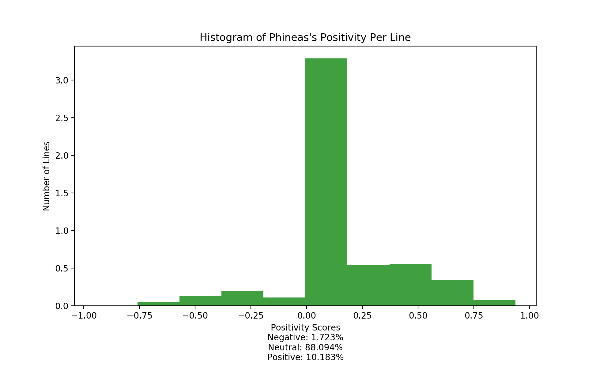
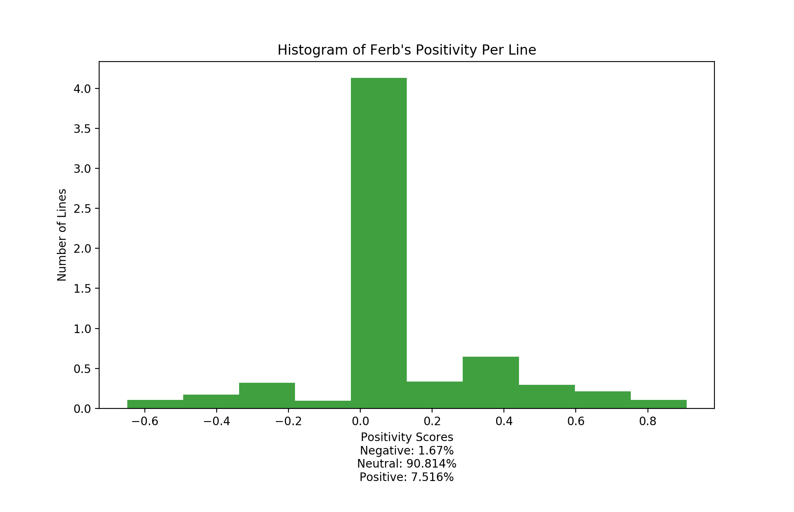
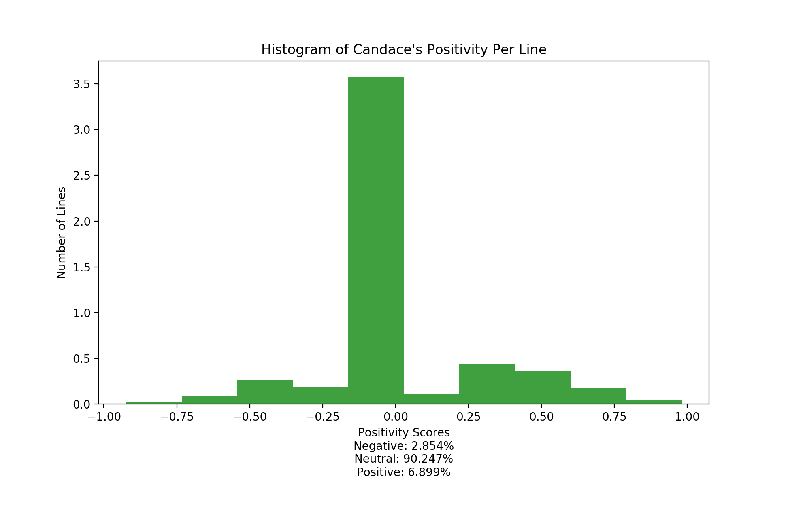
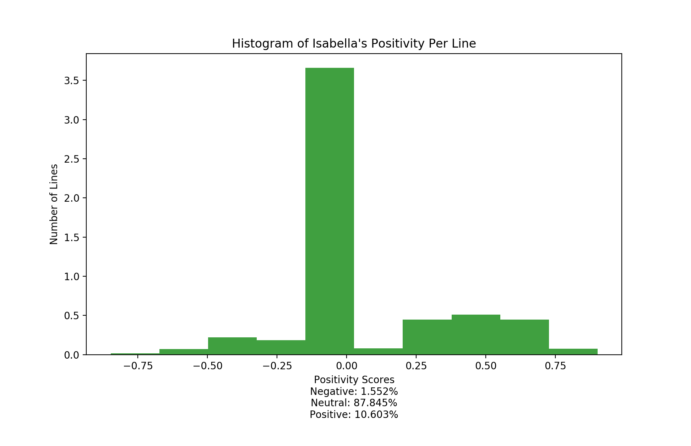
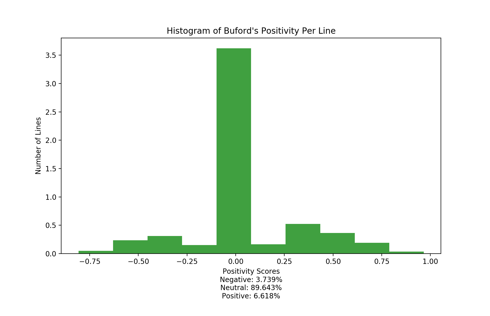
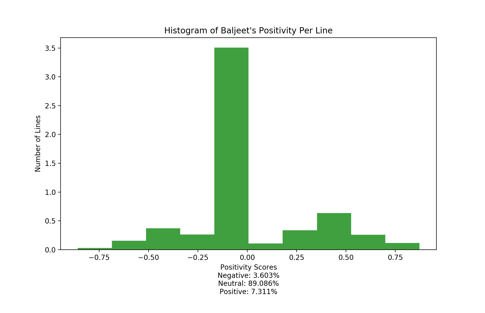
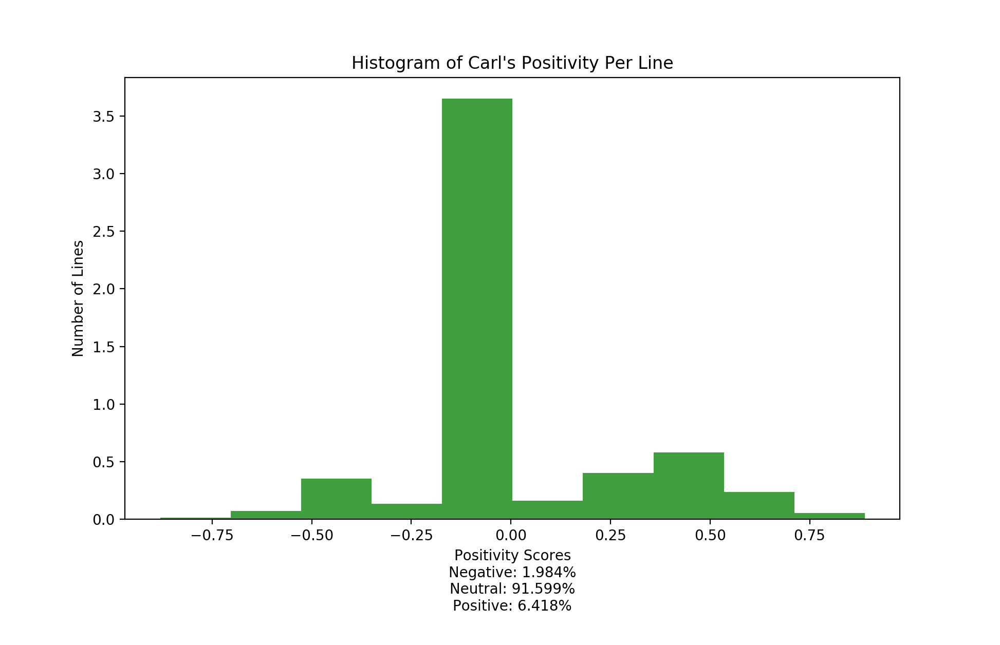
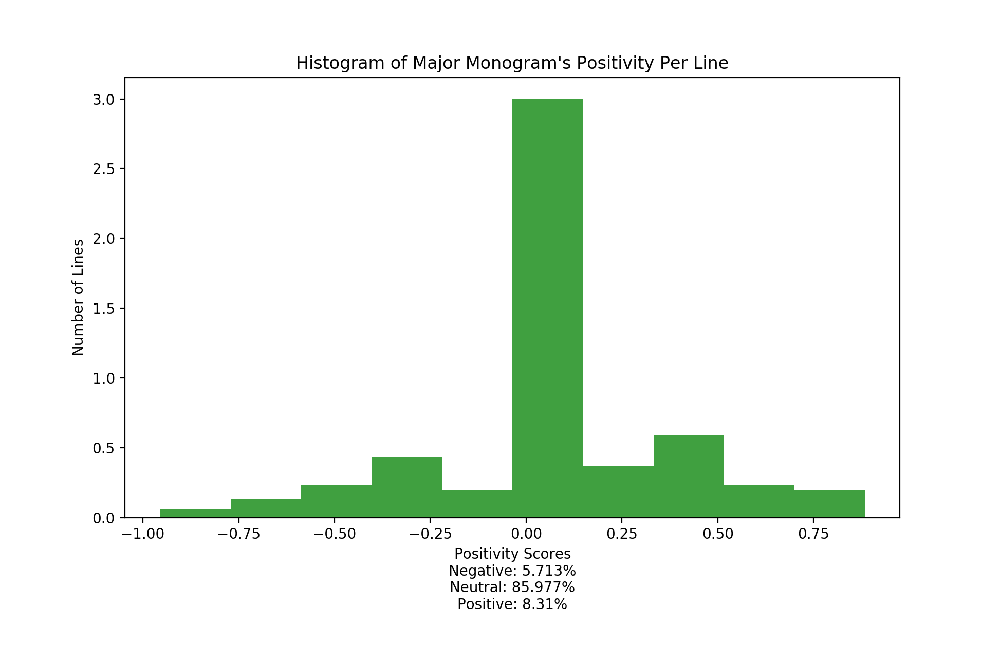
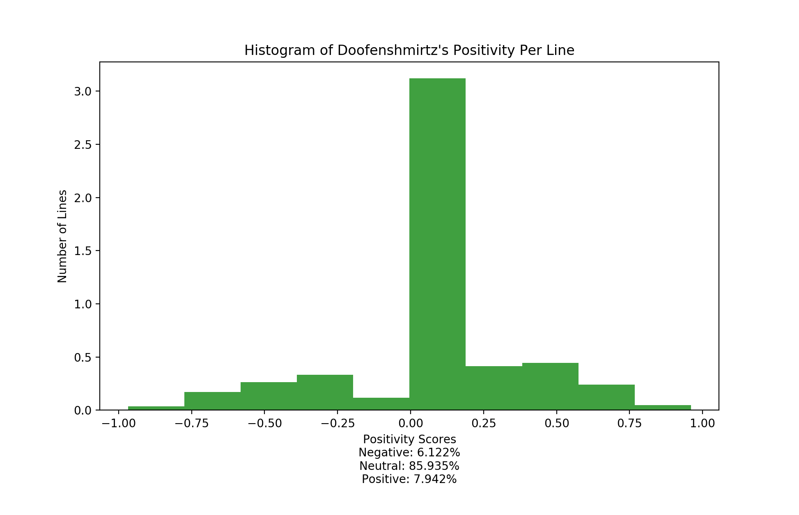
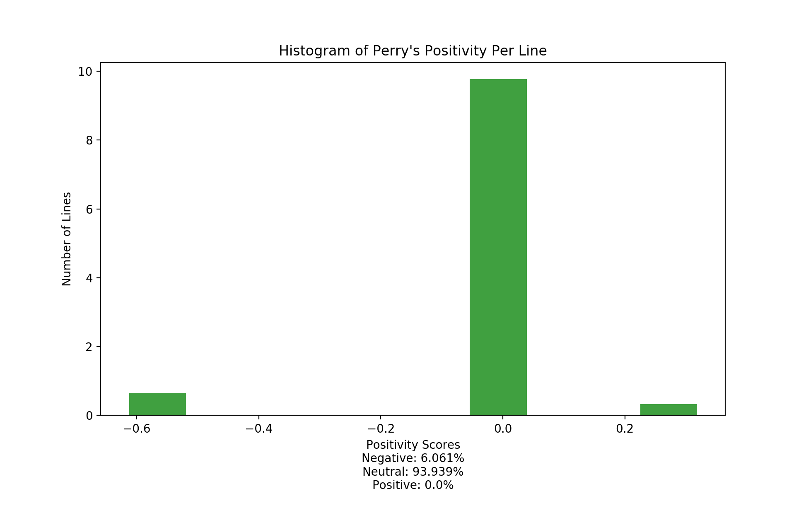
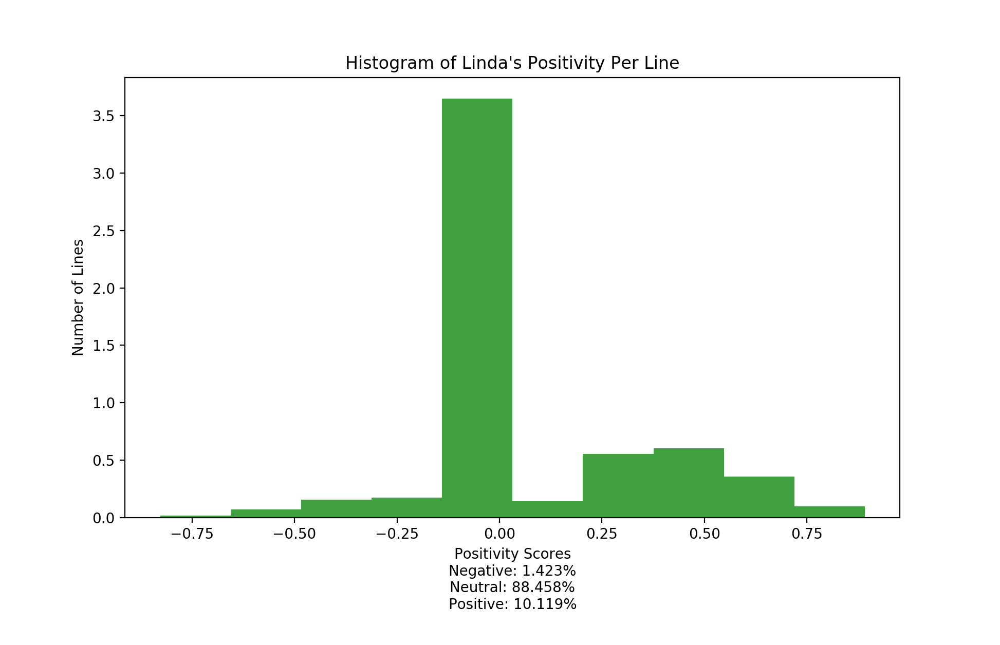

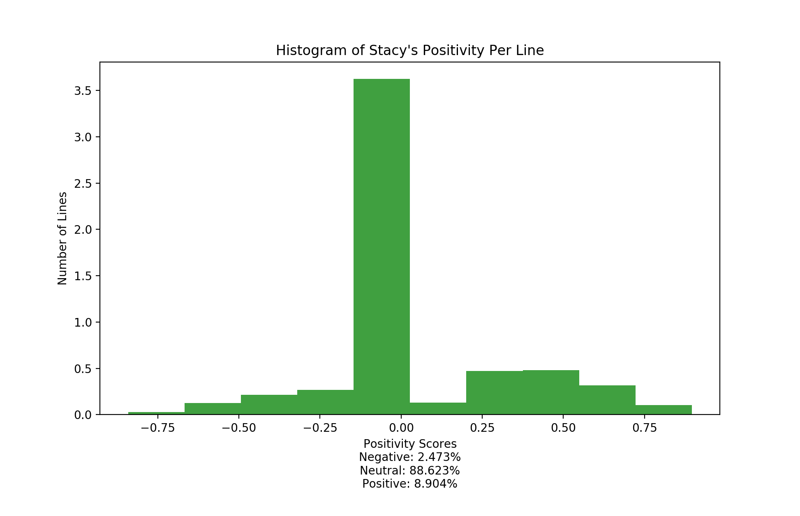
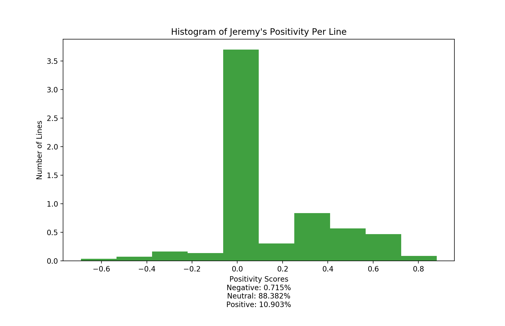
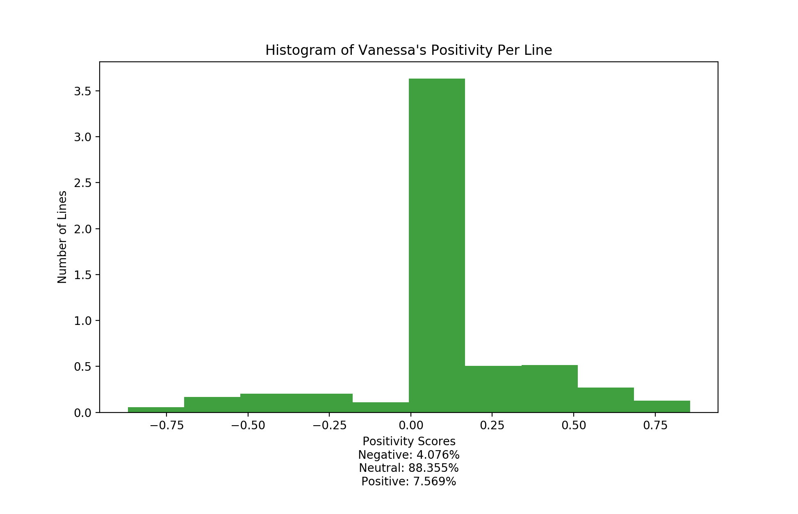

As we can see from the percentages, Doofenshmirtz and Major Monogram have far higher negative lines, while Phineas and Isabella have far higher positive lines. Those were not that surprising, given what we know about those characters.

What was surprising was how neutral and not negative Candace was - given her drama queen and "brother busting" tendencies, that seemed out of character.

All in all, an interesting project.
